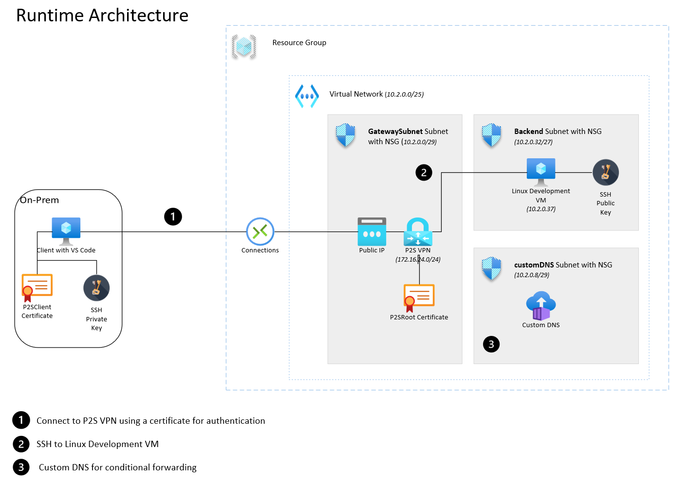

# Overview

The below steps will deployment an Azure environment using a VNET for hosting a private virtual machine and using a VPN Gateway to create a secure private environment for development where developers can use devcontainers on VS Code.

## Prerequisites 

- Azure Subscription for hosting the devcontainer hosts.
  - Examples of hosts are Linux VM's or Dev/Test Labs for hosting Linux VM's...
- Internet access to download and install VS Code
- Remote hosts able to install docker
- VS Code Extensions able to be installed on the developer desktop and devcontainer host.
- Able to generate ssh keys 
- Able to create self-signed certificate for VPN Gateway connectivity
- Access to setup ```ssh-agent``` on developer desktop/laptop
- Azure [cli](https://docs.microsoft.com/en-us/cli/azure/) and [bicep](https://docs.microsoft.com/en-us/azure/azure-resource-manager/bicep/overview?tabs=bicep) installed

 
## Client

Key to start with the client side as from here a few key dependent items will need to be created prior to deploying the Azure Services.

- Install VS Code (https://code.visualstudio.com/)
- Install the **Remote Development** extension:  
    
- Creates a ssh key pair for connecting to the VM via VS Code 
  - From Windows: https://docs.microsoft.com/en-us/azure/virtual-machines/linux/ssh-from-windows 
  - From Linux/Mac: https://docs.microsoft.com/en-us/azure/virtual-machines/linux/mac-create-ssh-keys
  - Example:
    ```powershell
      ssh-keygen -m PEM -t rsa -b 4096
    ```
- Copy the private ssh key into ```.ssh``` folder 
- Store both keys in a secure location for possible future use. The Public key will be used in a later step.
- Setup the SSH Agent for VSCode to use the key for SSH Remoting to the Virtual Machine using PowerShell.
  ```powershell
    set-service ssh-agent -startuptype "Automatic"
    start-service ssh-agent
    ssh-add C:\Users\<user>\.ssh\<keyname>
  ```
  If errors connecting to the DevContainer (e.g. Crypto Errors) Upgrade the ssh agent. The following Powershell with find the latest zip file links:  
  ```powershell
    [Net.ServicePointManager]::SecurityProtocol = [Net.SecurityProtocolType]::Tls12
    $url = 'https://github.com/PowerShell/Win32-OpenSSH/releases/latest/'
    $request = [System.Net.WebRequest]::Create($url)
    $request.AllowAutoRedirect=$false
    $response=$request.GetResponse()
    $([String]$response.GetResponseHeader("Location")).Replace('tag','download') + '/OpenSSH-Win64.zip'  
    $([String]$response.GetResponseHeader("Location")).Replace('tag','download') + '/OpenSSH-Win32.zip'
  ```
- **Optional**: Install Docker Extension for visibility of the containers and images created  
    

### Generate Certificate (Self-Signed) for connecting to VPN Gateway

This following process shows how to generate root and client certificates from a Windows machine using PowerShell. This is key to securely connect to the VPN Gateway from the client machine. The benefit is that the client machine will be directly connected into the VNET that's created later. Thus, no need for Bastion or public IP Addresses for using the development Virtual Machine

- Create certificates:
```powershell

$rootcert = New-SelfSignedCertificate -Type Custom ` -Subject "CN=P2SROOT" ` -KeyExportPolicy Exportable ` -KeySpec Signature ` -HashAlgorithm sha256 ` -KeyLength 2048 ` -CertStoreLocation "Cert:\CurrentUser\My" ` -KeyUsageProperty Sign ` -KeyUsage CertSign


New-SelfSignedCertificate -Type Custom ` -DnsName P2SCLIENT ` -KeySpec Signature ` -Subject "CN=P2SCLIENT" ` -KeyExportPolicy Exportable ` -HashAlgorithm sha256 ` -KeyLength 2048 ` -CertStoreLocation "Cert:\CurrentUser\My" ` -Signer $rootcert ` -TextExtension @("2.5.29.37={text}1.3.6.1.5.5.7.3.2")

```
- Export certificates:
  - Run commannd ```MMC``` to open the Microsoft Management Console.
  - Goto File/```Add or Remove Snap-ins```
  - Double click on Certificates and select ```My user account```
  - Click ```OK```
  - Goto ```Personal/Certificates``` 
  - Export the **root** certificate
    -   Do not export the private key
    -   Select Base 64 encoded X.509 (.CER)
  - Export the **client** certificate
    -   Yes, export the private key
    -   Make sure Personal Information Exchange - PKCS #12 (.PFX) is selected
    -   Enter password for securing the private certificate  
  - Store both certificates in a safe place for use later in the process

> The **root** certificate will be used to configure the P2S VPN Gateway  
> The **client** certificate will need to be installed in the client machine.


## Deploy Azure services including Virtual Machine

This will get the configuration inplace for deploying the Azure services.  

Below shows the architecture:

  
>Azure Private DNS Resolver is currently in Preview


- The following needs to be added to KeyVault as secrets, as they're used during the deployment process:
  - SSH Public Key
  - Public Root Certificate
    - > Remove the ```-----BEGIN CERTIFICATE-----``` and ```-----END CERTIFICATE-----```
- The Bicep parameters file needs to be updated for deployment. Here's a link to an example: [template.parameters.json](deploy/template.parameters.json)
- Sections in file (Key to update **"<...>"** values ) :
  -  General  
  ```json
  "resourceGroupName": {
      "value": "<Resource Group Name>"
    },
    "secretsKeyVault": {
      "value": {
        "kvName": "<Name of KeyVault>",
        "resourceGroup": "<Resource Group Name for KeyVault>"
      }
    },
    "namingConvension": {
      "value": {
        "environment": "<environment for naming e.g. prod>",
        "application": "<name of application e.g. vscode>"
      }
    },
    "location": {
      "value": "<location e.g. uksouth>"
    },
  ```
  - Networking
  ```json
      "vnet_object": {
      "value": {
          "addressPrefix": "10.2.0.0/25",
          "subnets" : [
            {
              "name": "GatewaySubnet",
              "addressSpace": "10.2.0.0/29",
              "specialSubnet": true,
              "securityRules": [],
              "delegations": []
            },
            {
              "name": "dnsresolver",
              "addressSpace": "10.2.0.16/28",
              "specialSubnet": false,
              "securityRules": [],
              "delegations": [
                {
                  "name": "delegationService",
                  "properties": {
                    "serviceName": "Microsoft.Network/dnsResolvers"
                  }
                }
              ]
            },
            {
              "name": "backend",
              "addressSpace": "10.2.0.32/27",
              "specialSubnet": false,
              "securityRules": [],
              "delegations": []
            },
            {
              "name": "frontend",
              "addressSpace": "10.2.0.64/27",
              "specialSubnet": false,
              "securityRules": [],
              "delegations": []
            }
          ]
        }
    },
  ```
  - DNS
  ```json
  "dnsresolver_object": {
        "value": {
          "subnet": "dnsresolver"
        }
      },
  ```
  - VPN Gateway
  ```json
  "vpn_object": {
      "value": {
        "sku": "Basic",
        "type": "Vpn",
        "addressPrefix": "172.16.24.0/24",
        "subnet": "GatewaySubnet",
        "generation": "Generation1",
        "keyVaultP2SCert": "<Secret Name from KeyVault for Public Root Certificate>"
      }
    },
  ```
  - Virtual Machine
  ```json
  "vm_object_array": {
      "value": [
        {
          "name": "dev",
          "adminUsername": "azureuser",
          "vmSize": "Standard_DS1_v2",
          "keyVaultSSHKey": "<Secret Name from KeyVault for Public SSH Key>",
          "subnet": "backend",
          "ipaddress": "10.2.0.37",
          "imageReference": {
            "publisher": "Canonical",
            "offer": "UbuntuServer",
            "sku": "18.04-LTS",
            "version": "latest"
          },
          "osDisk": {
            "osType": "Linux",
            "createOption": "FromImage",
            "caching": "ReadWrite",
            "managedDisk": {
              "storageAccountType": "Premium_LRS"
            },
            "deleteOption": "Detach",
            "diskSizeGB": 30
          }
        }
      ]
    }
  ```

- Deploy using Bicep
  - Login to Azure 
    ```
    az login --use-device-code
    ```
  - Change to the ```deploy``` folder
  - Run Bicep and use the parameters file updated and saved above
    ```
    az deployment sub create --name dev --location uksouth --template-file main.bicep --parameters main.parameters.json
    ```
  - Post deployment go to the VPN Gateway and ```reset``` it. Sometimes the client doesn't connect and this resolves that issue.
  - In to VPN Gateway download and install the ```VPN Client``` from the ```Point-to-site configuration``` section.
  - Connect to the VPN before moving to the next section 


## Process to connect to a DevContainer
- Connect to the remote host using ssh (e.g. azureuser@1.2.45.6) by running command:
  ``` Remote-SSH: Connect to Host  ```
  
- On the remote VM clone a repo (e.g. git clone ……)
- Run command : ``` Remote-Containers: Open Folder in container ```
- Select the folder you want and VS Code will create/open the devcontainer on the remote VM.  
  

# Example VS Code Commands
- To edit / Open SSH configuration file:  
  - ```Remote-SSH: Open SSH Configuration File```
- To connect to remote host:  
  - ```Remote-SSH: Connect to Host``` 
  - ```Remote-SSH: Connect Current Windows to Host```
- Reload VS Code Window if any config changes have been made (e.g. added new SSH Host in config file):  
  - ```Developer: Reload Window```
- Create new/replace devcontainer configuration files in a repo. :  
  - ```Remote-Containers: Add Development Container Configuration Files...```
- To configure the remote container:  
  - ```Remote-Containers: Configure Container Features```
- Once on remote VM to open a devcontainer to can either run:  
  - ```Remote-Containers: Open Folder in Container```


# Links
- [Developing inside a Container](https://code.visualstudio.com/docs/remote/containers)
- [Create a development container](https://code.visualstudio.com/docs/remote/create-dev-container)
- [devcontainer.json reference](https://code.visualstudio.com/docs/remote/devcontainerjson-reference)
- [Connect to remote Docker over SSH](https://code.visualstudio.com/docs/containers/ssh)
- [Generate a new SSH Key and adding it to the ssh-agent](https://docs.github.com/en/authentication/connecting-to-github-with-ssh/generating-a-new-ssh-key-and-adding-it-to-the-ssh-agent)

# Troubleshooting
- If you battle to SSH into the VM with an error related to man in the middle attack. Check the .ssh/known_hosts file for an entry for the same IP address. If so, delete the entry.
- When logging in to Azure via cli (az login) you might get an error with a redirect. Look at the page and add the port highlighted to PORT forwarding. (e.g. Port 44563 -> localhost:44563)
  - Login with ```az login```:
    - 
  - Login with your azure account when prompted.
  - Page can't be reached error could to shown:
    - 
  - Need to add port forwarding for the port highlighted above:
    -  
  - The page can't be reached with refresh automatically and log in once the port has been forwarded.
  - **Note:** The port will change every time you login.
- SSH Authentication issues with Azure DevOps
  - Make sure the key pair created for Azure DevOps is called *id_rsa* 
  - Add a SSH key to the development VM (.ssh) and to Azure DevOps.
  - Add a SSH key to the devcontainer (.ssh) and to Azure DevOps. Plus run the ```ssh-add <.ssh/is_rsa>``` statement to link the key coreectly

# Links
- [devcontainer ref](https://code.visualstudio.com/docs/remote/devcontainerjson-reference)
- [ssh](https://code.visualstudio.com/docs/remote/ssh)
- [Develop with Remote Host](https://code.visualstudio.com/remote/advancedcontainers/develop-remote-host)
- [CodeSpaces](https://code.visualstudio.com/docs/remote/codespaces)
- [Create VPN Gateway](https://www.getanadmin.com/azure/azure-point-to-site-vpn-setup-step-by-step/)
- [Setup CA in Ubuntu](https://www.digitalocean.com/community/tutorials/how-to-set-up-and-configure-a-certificate-authority-ca-on-ubuntu-20-04)
- [Public Key Encryption](https://www.okta.com/identity-101/public-key-encryption/)
